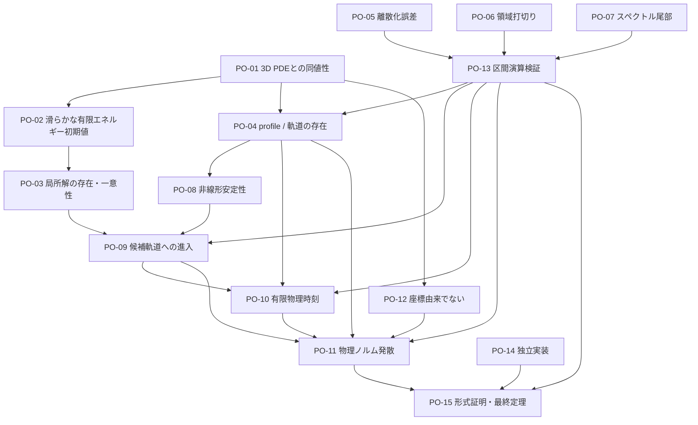

# Proof obligations

## 1. 何を証明しなければならないか

数値候補を「元の三次元非圧縮 Navier–Stokes 方程式が、滑らかな有限エネルギー初期値から有限時刻に特異性を生じる」という反例へ変換するには、近似 profile の小 residual だけでは足りない。本書は必要な義務を依存関係付きで管理する。

現在、このリポジトリは候補特異点も反例も証明していない。`equation_audit.md` で確認済みなのは、使用する古典解の式と軸対称変数系の同値性であり、未知候補軌道の存在・安定性・到達・発散ではない。

## 2. 分類

各義務の「主分類」は次のいずれか一つとする。補助的に別の方法が必要な場合は受入証拠欄に記す。

- **現在確認済み**: 現時点のリポジトリ内で、対象範囲を限定した導出・一次資料照合が完了している。
- **数値的に検査可能**: 浮動小数点計算で反証・品質検査はできるが、合格だけでは証明にならない。
- **コンピューター支援証明が必要**: 区間演算、厳密残差、作用素 bound、validated integration などが必要。
- **純粋解析が必要**: 関数空間、同値性、継続、安定多様体、発散の論証など、有限計算だけでは閉じない解析が必要。
- **未解決**: 現在の候補・手法では閉じ方が確定していない。

「数値的に検査可能」は「数値で証明可能」を意味しない。「現在確認済み」も記載した限定範囲だけを意味する。

## 3. 依存関係



主要な論理鎖は

\[
\text{明示初期値}
\Longrightarrow \text{局所古典解}
\Longrightarrow \text{候補軌道へ入る}
\Longrightarrow T<\infty
\Longrightarrow \|u(t)\|_X\to\infty
\Longrightarrow \text{古典解を継続不能}
\]

である。profile の局所存在 (PO-04) を証明しても、PO-08～PO-12 がなければこの鎖は閉じない。

## 4. 義務一覧

### PO-01 元の3次元PDEとの同値性

**主分類: 現在確認済み（古典的に滑らかな場、正しい極条件、十分な減衰という限定範囲）**

**内容。** 軸対称閉系
\((u_1,\omega_1,\psi_1)\) から

\[
u^\theta=ru_1,\qquad
u^r=-r\psi_{1,z},\qquad
u^z=2\psi_1+r\psi_{1,r}
\]

を回復したとき、物理三次元の
\(\nabla\cdot u=0\)、運動方程式、圧力、初期値を満たし、逆変換も成立すること。

**現在の証拠。** `equation_audit.md` E-01～E-24。特に E-15 は物理三次元発散、E-16 は軸極条件、E-18 は Cartesian 復元、E-24 は古典的同値性である。

**残る候補固有義務。**

- 候補が E-16 の全ての必要な極条件と採用関数空間を満たす。
- 無限遠/tail が圧力・流れ関数回復を正当化する。
- dynamic rescaling map が各 \(t<T\) で正則かつ可逆。
- 弱解・極限へ移る場合の同値性を、古典解の形式計算から別途拡張する。

**受入証拠。** 定理文、関数空間、軸 trace、無限遠条件、圧力規格化を明記した解析証明。Cartesian 独立 residual は必要な数値検査だが代用にならない。

### PO-02 滑らかな有限エネルギー初期データ

**主分類: 純粋解析が必要（係数上界の計算には CAS・区間演算を補助利用できる）**

**内容。** 明示された \(u_0\) が

\[
u_0\in C_c^\infty(\mathbb R^3)
\quad\text{または承認された Schwartz 級},\qquad
\nabla\cdot u_0=0,\qquad
\int_{\mathbb R^3}|u_0|^2dx<\infty
\]

で、軸対称・旋回あり・軸適合であること。

**数値検査。** 発散、parity、エネルギー、tail、旋回非零性、保存後再読込。
これらは反証・品質検査であり、\(C^\infty\) 性、厳密な発散ゼロ、tail
積分の有限性を閉じない。

**証明として必要なもの。**

- 初期値を有限個の明示係数と解析的/区分的 \(C^\infty\) 基底で定義する。
- compact support の接合で全階微分が消えること、または Schwartz 減衰を解析的に示す。
- 発散ゼロを stream function 構成から恒等的に示す。
- 物理測度 \(2\pi r\,dr\,dz\) でエネルギー積分を厳密上界評価する。

**依存。** PO-01。

**完了条件。** 人手で再計算可能な式、係数の有理/区間表現、エネルギーの厳密有限上界。格子配列だけの初期値は不可。

### PO-03 局所解の存在・一意性

**主分類: 純粋解析が必要**

**内容。** PO-02 の初期値から、ある \(T_0>0\) まで一意な古典解または \(H^m\), \(m>5/2\), の強解が存在し、最大存在時刻 \(T_*\) が定義できること。

**方法。** 全空間では、たとえば [KatoPonce1988] の Bessel-potential
空間 \(L_s^p(\mathbb R^3)=(I-\Delta)^{-s/2}L^p\),
\(1<p<\infty\), \(s>3/p+1\) の局所適切性を使える。
\(p=2\) なら上記の \(H^m\), \(m>5/2\) と一致する。採用する定理について
領域、\(\nu>0\)、初期値空間、発散ゼロ条件を明記し、その仮定を PO-02
から検証する。必要なら mild formulation と weak–strong uniqueness を使う。

**依存。** PO-01, PO-02。

**完了条件。** 引用定理の仮定と候補初期値の対応を一項ずつ示す。solver が短時間安定に動くことは存在証明の代用ではない。

### PO-04 候補軌道またはプロファイルの存在

**主分類: コンピューター支援証明が必要**

**内容。** fixed point、rescaled periodic orbit、準定常/connecting orbit のどれを主張するかを固定し、無限次元の関数空間で厳密解が近似係数の近傍に存在することを示す。

**必要要素。**

- gauge/phase を含む作用素方程式 \(F(X)=0\)。
- Banach 空間と重み、軸 parity、tail、実/複素対称性。
- 近似解 \(\bar X\)、近似逆作用素 \(A\)。
- residual bound \(Y=\|AF(\bar X)\|\)。
- inverse defect と非線形 Lipschitz bound \(Z(r)\)。
- \(Y+Z(r)<r\) 型の contraction/radii polynomial 条件。
- periodic orbit なら周期と phase、connecting orbit なら端点 manifold 条件。

**依存。** PO-01, PO-05, PO-06, PO-07, PO-13。

**完了条件。** 「離散方程式の根」ではなく連続作用素の解を囲う定理。AI重み、小 collocation residual、単一精度 Newton 収束だけでは不可。

### PO-05 離散化誤差の制御

**主分類: コンピューター支援証明が必要**

**内容.** 空間・rescaled time の projection、微分、quadrature、nonlinear convolution、時間積分が連続作用素とどれだけ違うかを厳密に上界評価する。

**数値前段.** manufactured solution の収束次数、\(N,3N/2,2N\) 系列、dealiasing、独立差分。

**厳密段階.**

- basis interpolation/projection error の区間上界。
- derivative と product/convolution の operator norm。
- aliasing を除いた exact/validated convolution。
- finite-time segment なら validated time integration の局所・大域誤差。
- 浮動小数点入力係数を包含する区間化。

**依存。** PO-01。

**完了条件。** 観測収束次数ではなく、候補ごとの明示上界が PO-13 の不等式へ入る。

### PO-06 領域打ち切り誤差の制御

**主分類: コンピューター支援証明が必要**

**内容.** 数学上の \(\mathbb R^3\) を有限円柱・mapped interval で近似した誤差、特に楕円速度回復と圧力の非局所 tail を制御する。

**必要要素.**

- 内部数値領域と外部解析領域の分割。
- 外部での \(u_1,\omega_1,\psi_1,p\) の減衰 class。
- Green kernel または weighted elliptic estimate。
- 人工境界値と真の trace の差の上界。
- 物理エネルギー、Serrin/BKM量への tail 寄与。
- ring/core が境界から十分離れることではなく、無限遠までの数学的 bound。

**依存。** PO-01, PO-07。

**完了条件。** 領域倍増で差が小さいという経験則を、外部寄与の厳密上界へ変換する。

### PO-07 スペクトル尾部の評価

**主分類: コンピューター支援証明が必要**

**内容.** 保存した有限係数の外側にある無限個の mode を制御し、微分・積・楕円逆で bound が閉じることを示す。

**必要要素.**

- weighted \(\ell^1_\nu\)、\(\ell^2_s\)、analytic/Gevrey、Sobolev など採用空間。
- projection tail の上界。
- quadratic convolution の Banach algebra estimate。
- 楕円逆の高 mode estimate。
- 軸基底と無限遠 map による係数増大の制御。
- periodic orbit なら space-time 二重 tail。

**依存。** PO-05。

**完了条件。** 「最後の係数が小さい」ではなく、全 tail の和・微分 tail・非線形 tail の区間上界。

### PO-08 非線形安定性

**主分類: コンピューター支援証明が必要**

**内容.** 候補 invariant object の近傍で rescaled flow がどう振る舞うかを示し、gauge 中立方向と真の不安定方向を分類する。

**必要要素.**

- 線形化作用素の spectrum/exponential dichotomy。
- fixed point の unstable/stable/center subspace、または periodic orbit の Floquet bundle。
- essential/tail spectrum と有限 truncation の spurious eigenvalue の分離。
- 非線形 remainder bound。
- center-stable manifold または trapping/cone condition。
- 物理有限エネルギー空間と rescaled norm の対応。

**依存。** PO-04, PO-07, PO-13。

**完了条件。** 近似固有値ではなく、区間で分離された spectral bounds と局所不変多様体。安定性が不要な特殊な exact connecting orbit を直接検証する場合は、その代替論証を明記する。

### PO-09 滑らかな初期データから候補軌道へ入ること

**主分類: 未解決**

**内容.** PO-02 の明示初期値から出る PO-03 の解が、有限時刻で PO-08 の検証済み近傍・stable manifold・trapping region へ入ること。

**考えられる方法.**

- interval ODE/PDE integration と multiple shooting。
- low/high mode 分解、低 mode の validated integration、高 mode の dissipative enclosure。
- edge tracking で得た近似を、transversality と interval Newton で connecting orbit へ変換。
- analytic trapping region への entry inequality。

**依存。** PO-02, PO-03, PO-04, PO-08, PO-13。

**完了条件。** 一つの浮動小数点軌道が profile に近づくことではなく、初期値を含む厳密 enclosure が検証済み entry section を横切ること。

**未解決理由.** 無限次元、長時間、強い不安定性、tail の同時制御が必要であり、候補がない現時点では適切な証明戦略を選べない。

### PO-10 有限の物理時刻であること

**主分類: コンピューター支援証明が必要**

**内容.** rescaled time \(\tau\to\infty\) が物理時間 \(t\to T<\infty\) に対応すること。`future_search.md` の規約なら

\[
T-t(\tau_0)
=\int_{\tau_0}^{\infty}\frac{L_z(\tau)}{C(\tau)}\,d\tau<\infty.
\]

**必要要素.**

- scale functions の正値と絶対連続性。
- modulation rates の厳密上下界。
- 積分 tail の比較関数または区間評価。
- periodic/quasi-periodic rates なら一周期平均と fluctuation bound。
- ring branch なら \(R(t)\to0\) も別に証明。

**依存。** PO-04, PO-09, PO-13。

**完了条件。** 有限窓 power-law fit ではなく、\(\tau=\infty\) までの積分を閉じる厳密上界。

### PO-11 適切なノルムが発散すること

**主分類: コンピューター支援証明が必要**

**内容.** 元の物理場で、古典解の継続を妨げるノルムが

\[
\limsup_{t\uparrow T}\|u(t)\|_{H^m}=\infty
\]

などと発散することを示す。より直接には、profile の非退化下限と scales から
\(\|\omega(t)\|_\infty\)、Serrin 臨界量、または continuation norm の下限を得る。

**必要要素.**

- rescaled profile が零へ退化しない厳密下限。
- scale amplitudes の発散率の下限。
- 物理 norm への正しい Jacobian・成分変換。
- cancellation で norm が消えないこと。
- BKM/Serrin/Type I 既知結果との整合。
- \(t<T\) の各時刻では場が滑らかであること。

**依存。** PO-01, PO-04, PO-09, PO-10, PO-12, PO-13。

**完了条件。** 無限個の \(t_n\uparrow T\) に対する厳密下限、または全 tail interval に対する単調下限。大きな有限値、overflow、fit exponent だけでは不可。

### PO-12 座標変換による見かけの発散ではないこと

**主分類: 純粋解析が必要**

**内容.** \(u_1=u^\theta/r\)、\(\omega_1=\omega^\theta/r\)、adaptive map、dynamic rescaling の係数だけが発散し、Cartesian 物理場は滑らかなまま、という可能性を排除する。

**必要要素.**

- 各 \(t<T\) で \(L_r,L_z,C>0\) と map の diffeomorphism。
- 軸 parity により \(u^\theta,\omega^\theta,\psi^\theta=O(r)\)。
- Cartesian \(u,\omega\) の明示復元。
- 物理三次元 norm の下限。形式的五次元 measure を使わない。
- gauge を変えても物理発散主張が不変。
- ring center、軸、集中幅の物理位置を追跡。

**依存。** PO-01。

**完了条件。** 少なくとも一つの coordinate-invariant な物理 continuation norm の発散を PO-11 で示す。

### PO-13 区間演算による検証

**主分類: コンピューター支援証明が必要**

**内容.** PO-04～PO-11 の有限計算部分を、外向き丸めを持つ区間/ball arithmetic で包含する。

**必要要素.**

- 使用 library、version、丸め規約、hardware 前提。
- 入力 decimal/float を最初から包含する interval conversion。
- transcendental/map/basis evaluation の rigorous enclosure。
- interval linear algebra、sparse/FFT convolution の丸め誤差。
- dependency/wrapping effect の抑制。
- proof inequality の machine-readable certificate と小さな独立 checker。
- checker が一係数・一 bound の改変を拒否する negative test。

**依存。** PO-05, PO-06, PO-07。

**完了条件。** 同じマシンの再実行で同じ小数を得ることではなく、真値を含むことが保証された不等式。

### PO-14 独立実装による再現

**主分類: 数値的に検査可能**

**内容.** production solver と数学的誤りを共有しない別実装が、候補係数から主要 residual、軸条件、物理復元、エネルギー、proof inequalities を再計算する。

**独立性の最低条件.**

- 同じ RHS/derivative matrix 関数を import しない。
- 別離散化または別 basis。
- 期待値を production code から生成しない。
- 可能なら別言語・別 interval library・別研究者。
- candidate と diagnostics の hash/provenance を検査。

**依存。** PO-04, PO-13。

**完了条件。** 許容差と比較規則を事前指定し、失敗を含む全結果を保存する。独立再現は証明を強くするが、PO-01～PO-13 の代替ではない。

### PO-15 将来的な形式証明

**主分類: 純粋解析が必要**

**内容.** 人手の定理文、関数空間、座標変換、局所可解性、validated inequalities、最終継続不能論証を、proof assistant で検査可能な形へ移す。

**候補工程.**

1. Navier–Stokes と軸対称変換の定義。
2. 軸 parity と Cartesian 復元。
3. 局所存在定理は既存 library が不足すれば、信頼する外部定理として境界を明記。
4. interval checker の整数/有理不等式。
5. contraction mapping、stable manifold、finite-time integral、norm lower bound。
6. 最終定理の仮定から「最大古典解が有限 \(T\) を越えて継続できない」まで。

**依存。** PO-01～PO-14。

**完了条件。** trusted computing base、未形式化定理、外部 binary、丸め公理を列挙する。形式化されていない部分があれば「完全形式証明」と呼ばない。

## 5. 分類要約

| ID | 義務 | 主分類 | 現状 |
|---|---|---|---|
| PO-01 | 元の3D PDEとの同値性 | 現在確認済み | 古典的・軸適合・十分減衰の範囲で式監査済み。候補固有仮定は未検査 |
| PO-02 | 滑らかな有限エネルギー初期値 | 純粋解析が必要 | 候補初期値未選定。数値診断は補助に限る |
| PO-03 | 局所解の存在 | 純粋解析が必要 | 適用する標準定理は既知、候補への適用は未実施 |
| PO-04 | 候補 profile / 軌道の存在 | コンピューター支援証明が必要 | 候補なし |
| PO-05 | 離散化誤差 | コンピューター支援証明が必要 | 空間manufactured収束と固定格子時間収束は前段検査。厳密上界なし |
| PO-06 | 領域打ち切り誤差 | コンピューター支援証明が必要 | 数値的領域比較のみ可能。厳密 tail なし |
| PO-07 | スペクトル尾部 | コンピューター支援証明が必要 | 明示候補係数なし |
| PO-08 | 非線形安定性 | コンピューター支援証明が必要 | 未着手 |
| PO-09 | 候補軌道への進入 | 未解決 | 候補がないため戦略未確定 |
| PO-10 | 有限物理時刻 | コンピューター支援証明が必要 | scale trajectory なし |
| PO-11 | 適切なノルム発散 | コンピューター支援証明が必要 | 数値的にも未確認 |
| PO-12 | 座標由来でない | 純粋解析が必要 | 復元式は監査済み、候補への適用なし |
| PO-13 | 区間演算検証 | コンピューター支援証明が必要 | infrastructure 未実装 |
| PO-14 | 独立実装による再現 | 数値的に検査可能 | 一様Cartesian別実装でdivergence・full curl・primitive残差を検査済み。未知候補の再現はなし |
| PO-15 | 形式証明 | 純粋解析が必要 | 未着手 |

## 6. 証明書 bundle の将来仕様

一つの義務を「完了」とする成果物は、少なくとも次を含む。

```text
certificate/
  theorem.md                 # 正確な仮定・結論・依存義務
  candidate_coefficients.*   # 明示係数、scale、maps、tail model
  bounds.json                # Y, Z, tail, truncation, time, norm bounds
  provenance.json            # code/data/dependency/hash
  checker/                   # 小さな独立 checker
  checker_results.json
  reconstruction/            # 物理3D場への復元規約
  independent_report.md
```

`bounds.json` の一値を変更すると checker が失敗する negative fixture を付ける。図、ニューラルネット重み、巨大な未説明 checkpoint は証明書の中核にしない。

## 7. 義務の状態遷移

各 ID は `unstarted -> numerical_evidence -> rigorous_bound -> independently_checked -> closed` の順で進める。

- `numerical_evidence`: 浮動小数点検査に合格。
- `rigorous_bound`: 外向き丸めまたは解析不等式で bound。
- `independently_checked`: 別 checker/実装で検査。
- `closed`: 依存義務も閉じ、定理文中で使える。

後段の義務が閉じても依存義務を飛ばさない。反例という最終主張は PO-01～PO-14 が閉じ、PO-15 の trusted boundary が明示された後にのみ審査対象となる。

## 8. 現時点での次の最小の一手

〔改版 2026-07-28。旧 §8 が求めた独立楕円 solver は実装済みである:
solver C(`realspace_poisson.py`、実空間 z 差分 CG、FFT 非依存)を含む
3 経路相互検証。旧文の要求 1–4 は `tests/test_realspace_poisson.py` と
`tests/test_poisson_cross_validation.py` が満たす。〕

PO-05/PO-14 の**前段**として本セッションで追加したもの(いずれも浮動
小数点検査であり、義務を閉じない):

- P0-A: 凍結係数 von Neumann 監査(`von_neumann.py`)。出荷済み Heun 実行
  は「stability-unverified」と再分類(`docs/numerical_stability_audit.md`)。
- P0-A: SSPRK3/RK4 交差検証積分器と Gate 1 相互比較実験。
- P0-B/P0-C: 全 accepted step の streaming gate(`step_stream`/
  `gate_summary`)。間引き経由の違反見逃しを合成 trajectory テストで排除。
- P0-D: core-width/points-per-scale 前提条件
  (`PREREGISTERED_MIN_POINTS_PER_FRONT = 7`)。現行の全 Hou snapshot は
  収束 fit の前提を満たさない(fit 禁止が機械化された)。
- P1-A: blind 外挿(`extrapolation.py`)。現行ラダーは
  not_in_asymptotic_range であり、いかなる極限値も引用不可。
- P1-C: 壁項込み離散エネルギー収支と viscosity_sign fault 棄却。

未知候補探索(Milestone B)の前の**次の最小の一手**は Gate 4
(真の全空間移行、`docs/whole_space_transition.md` §7)である:
非周期 \(z\) の有限 box、\(z\) 方向も \(C^\infty\) compact な初期値族、
free-space 楕円経路、\(R_{\max}\)/\(Z_{\max}\) 独立拡大、低波数 stress
test。これが通るまで、現在の Hou 機構を Clay の \(\mathbb R^3\) 候補と
呼ばず、中後期成長・blow-up fit・AI 候補探索へ進まない。
